# 🎓 Finals Week: O Pesadelo da Prova

> *Um jogo educativo sobre o desespero de todo universitário que deixa para estudar na última hora.*

---

## 📖 Sobre o Projeto

Este jogo foi desenvolvido como parte da disciplina de **Extensão 2** do curso de **Ciência da Computação** da **Universidade Estadual do Ceará (UECE)**.

O objetivo principal é **gamificar o aprendizado** de conteúdos introdutórios da computação (como Lógica Digital e Algoritmos), tornando a revisão divertida e interativa para novos alunos.

---

## 🎮 A História

Você controla um aluno de Computação que "aproveitou" um pouco demais o mês jogando e deixou os estudos de lado. 

Chegou o **Dia da Prova**. O desespero bate, o cansaço acumula e, durante o exame, ele acaba cochilando. Mas não é um sono tranquilo! Ele acorda **dentro do mundo da matéria**. 

Para sair desse pesadelo e acordar a tempo de entregar a prova, ele precisa vencer os desafios propostos pela própria disciplina, enfrentando portas lógicas e bugs.

---

## 🕹️ Gameplay e Mecânicas

O jogo é dividido em **3 Fases**, cada uma representando uma prova/matéria diferente. O ciclo de gameplay funciona assim:

1.  **O Sonho:** O jogador entra em um mundo onírico baseado no conteúdo da cadeira.
2.  **O Desafio:** Mecânicas de plataforma e lógica onde o jogador deve resolver problemas (ex: acertar a porta lógica correta - AND, OR, NOT) para avançar.
3.  **O Despertar (Quiz):** Ao final da fase, o aluno acorda e deve responder a questões teóricas na folha da prova para garantir a nota.
### 📸 Screenshots

> **💡 Dica:** Clique na primeira imagem para assistir à demonstração da lógica do jogo!

| [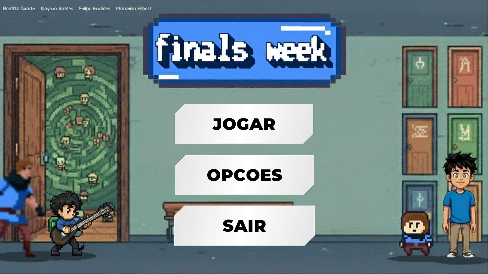](https://www.youtube.com/watch?v=XMfzlVOL1_0) |
|:---:|
| 🎬 *ASSISTIR DEMONSTRAÇÃO DO JOGO* |

| Menu Inicial | Mapa de Seleção | Fase 1 (Portas Logicas) |
|:---:|:---:|:---:|
| 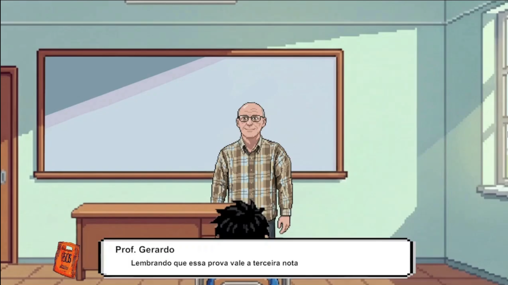 | 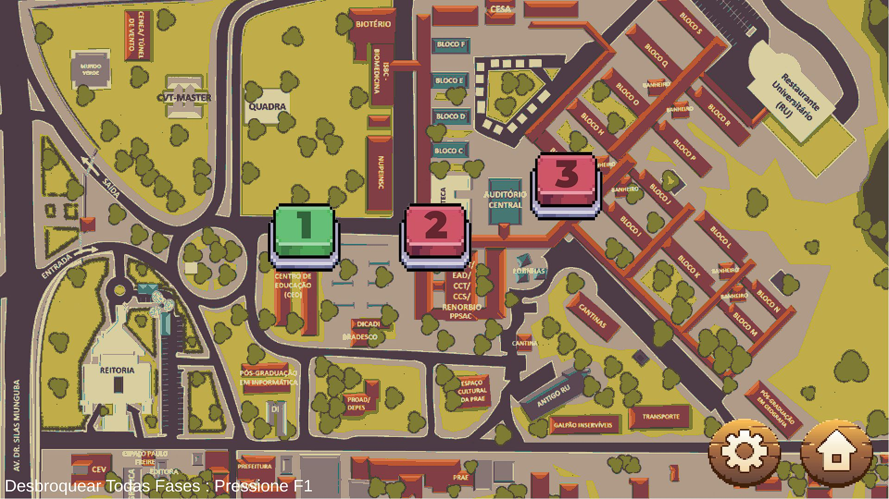 | 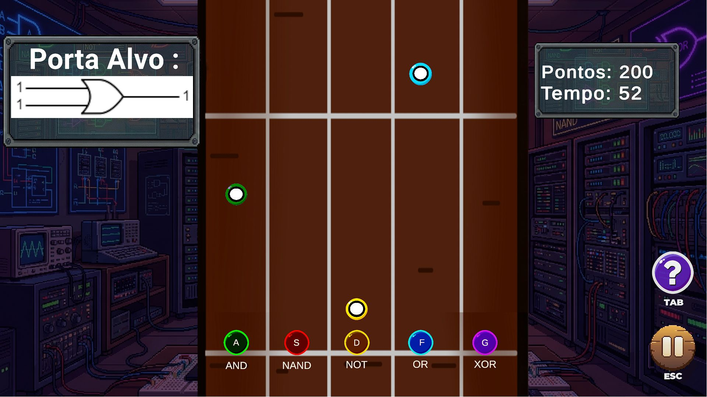 |
| **Fase 2 (Programacao e algoritmo)** | **Fase 3 (Desafio)** | **Chefe Final** |
| 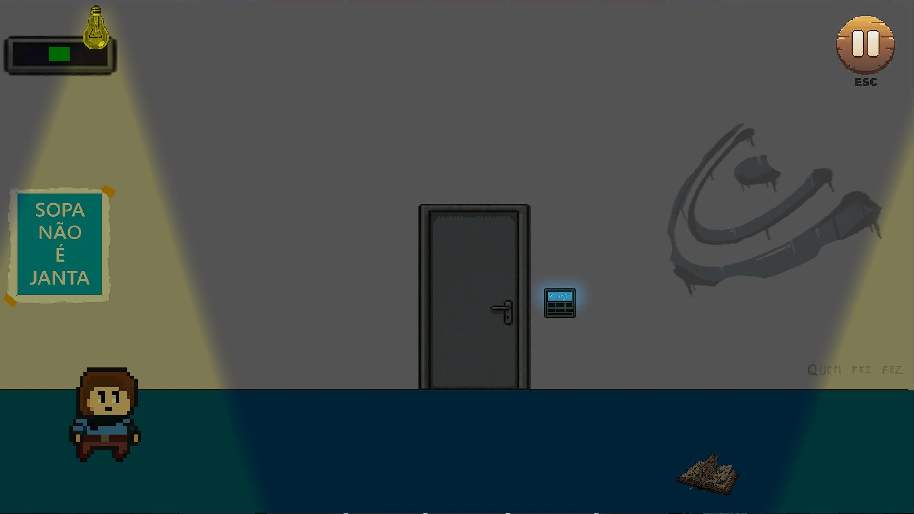 |  | 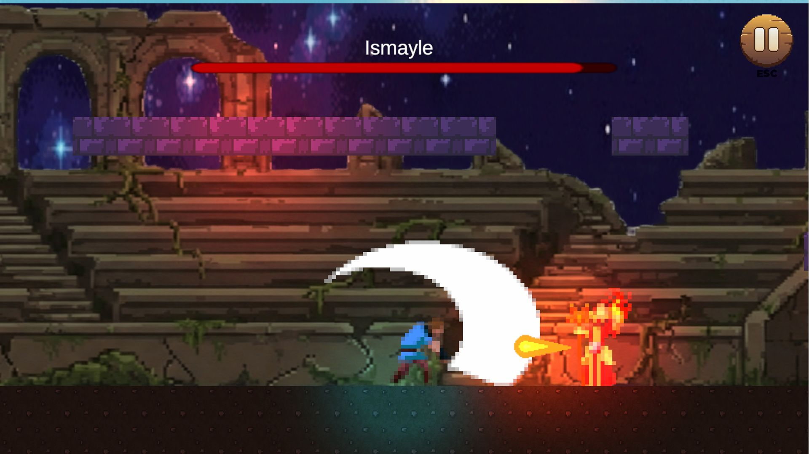 |
| **cutscene** | **cutscene** | **Chefe Final** |
| 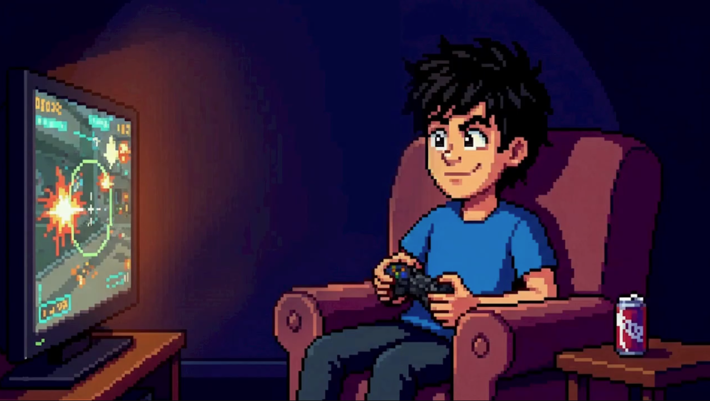 | 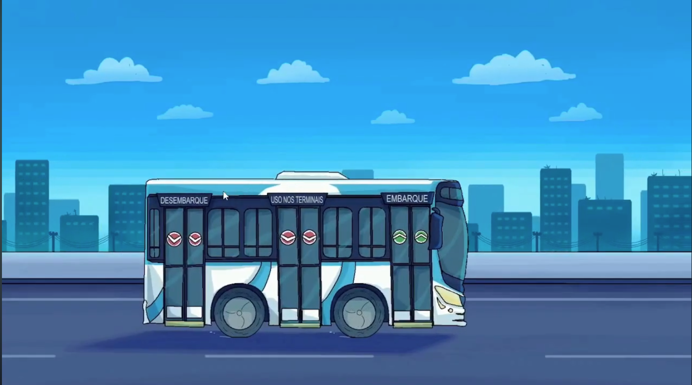 | 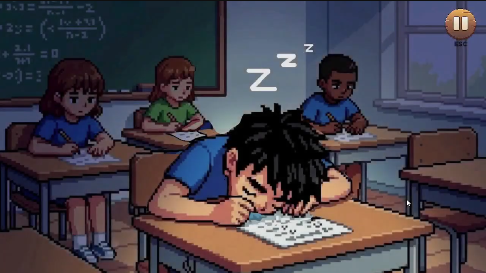 |
| **Cutscene** | **Prova Escrita** | **Chefe Final** |
| 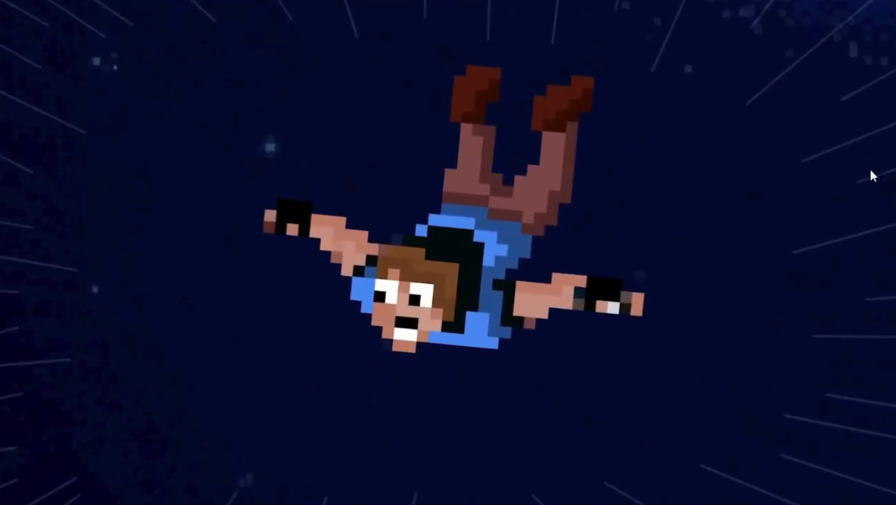 |  | 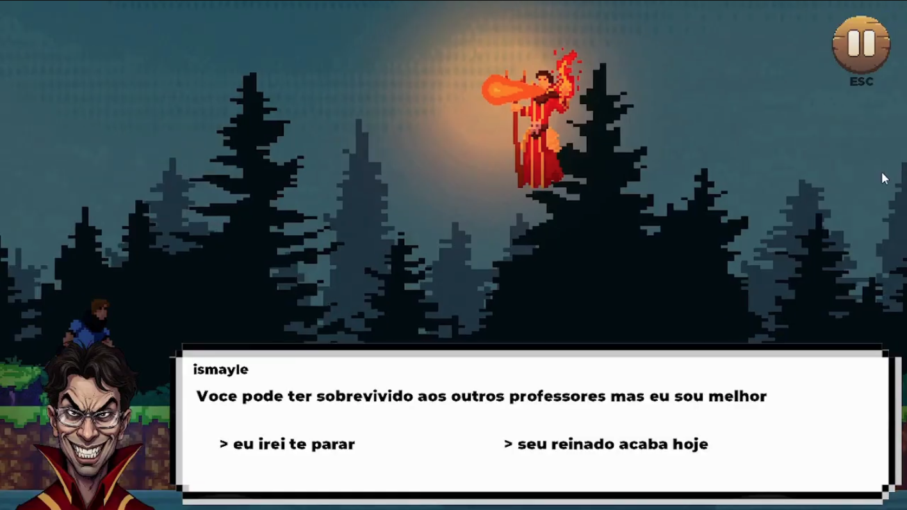 |

## 🛠️ Tecnologias e Ferramentas

Utilizamos um conjunto de ferramentas para dar vida ao projeto:

| Categoria | Ferramenta | Uso |
| :--- | :--- | :--- |
| **Engine** |  | Desenvolvimento do jogo e scripts C# |
| **Pixel Art** | **Aseprite** | Criação de sprites, personagens e animações |
| **Arte Conceitual** | **Krita** | Esboços, cenários e ilustrações |
| **Vídeo** | **Clipchamp** | Edição e montagem das cutscenes |
| **Versionamento**|  | Hospedagem e controle de versão |

---

## 🚀 Como Jogar

1.  Vá até a aba **[Releases](../../releases)** deste repositório.
2.  Baixe o arquivo `.zip` correspondente ao seu sistema operacional (**Windows** ou **Linux**).
3.  Extraia o arquivo.
4.  Execute o arquivo:
    * **Windows:** `FinalsWeek.exe`
    * **Linux:** `FinalsWeek.x86_64` (Lembre-se de dar permissão de execução!)
5.  Divirta-se e tente não reprovar!

---

## 👨‍💻 Desenvolvedores

Projeto criado por alunos da UECE:

* **Kaynan santos** - 
* **Ana Beatriz** - 
* **Luis Felipe** -
* **Hilbert Mardonio** 

---

## 📄 Licença

Este projeto é de uso acadêmico e educacional, desenvolvido para a disciplina de Extensão da UECE.

